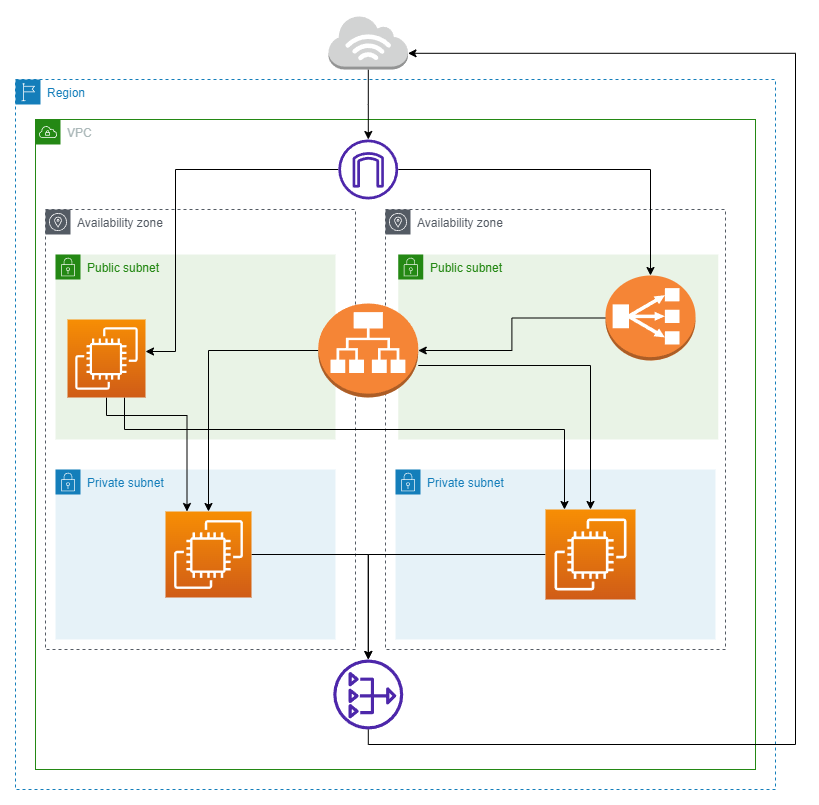

## Architecture Overview

Custom VPC spanning 2 availability zones with a total of 2 public subnets and 2 private subnets.

Inbound Traffic from the Internet goes via a Network LB with a static IPV4 Address which is then routed
to a Application LB which distrubutes traffic across Web APPs in private subnets.

One jump server running in a public subnet is used for deployment.

## Steps To Spin up the Infrastructure

- install terraform and AWS CLI locally  
- run AWS Configure and set access credentials to your .aws/credentials file and your region to your .aws/config file (if you are using a region other than eu-west-2 you will need to change the instance amis in this repo)
- update /terraform/provider.tf in this repo to make sure the shared_credentials_files are using your own path.
- make sure the key pair you want to use for the EC2 Instances is in your .ssh directory and is named mykeypair.pem or Change the Code in /terrafor/modules/deployments/main.tf to match the name of your keypair
- run `terraform init` inside the /terraform directory
- run `terraform plan` and then `terraform apply` to spin up the infra 

## Deploy Static HTML Application

- run `sh copyFilesAndExecuteDeploy.sh <PathToKeyPair> <PathToWebAppFiles> <PathToDepoyScript> <JumpServerHostName> <Bank0HostName> <Bank1HostName>` making sure to replace the args. This will copy the html application files, your key pair and Deploy Script to the jump server and execute the deploy script, deploying and starting the html application on both banks.
